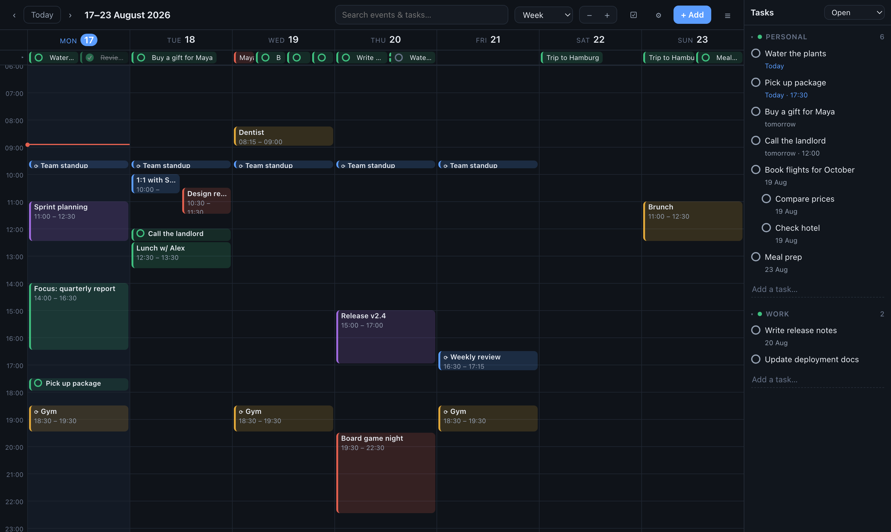
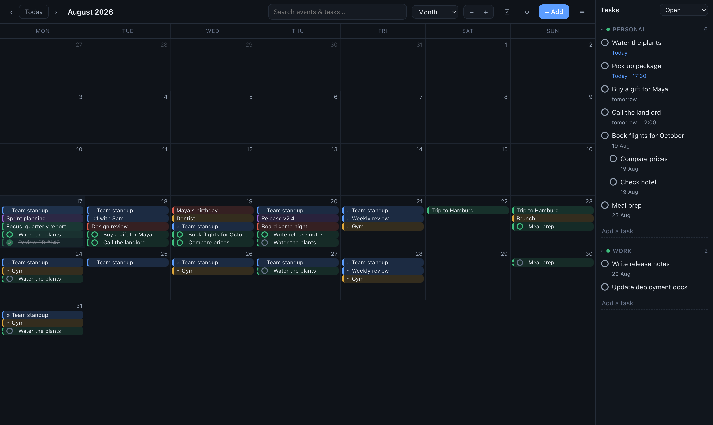
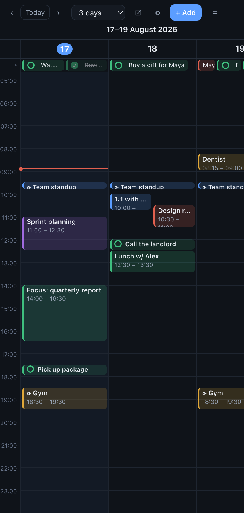
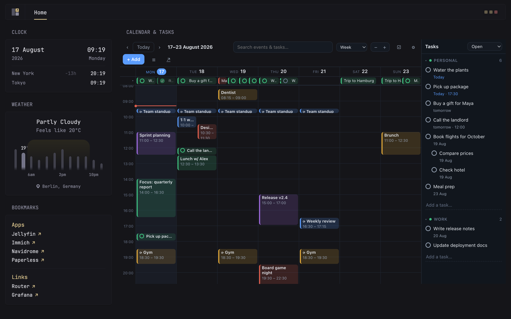

# caltask

A self-hosted calendar **and** task list in one small container. A week view
that behaves like the one you're used to, tasks that behave like a real task
app, and read-only `.ics` feeds so everything shows up in the calendar app you
already use — with **no account setup on your phone, no CalDAV, no external
services, no build step and no CDN.** And it [embeds in your dashboard](#embedding-in-a-dashboard)
(Glance, Homepage, …) as a **live, fully interactive widget** — not a screenshot.

```bash
docker compose up -d
```

Open <http://localhost:8090>. That's the whole installation.



---

## Why

Self-hosted calendars generally make you choose between two bad options:

* **A CalDAV server** (Radicale, Baïkal) — solid protocol, but there is no
  usable web UI, and every device needs a hand-configured account. On iOS that
  means an *Add Account → Other → CalDAV* dance plus an SSL warning to click
  through, per device.
* **A full groupware suite** (Nextcloud) — a good calendar buried inside a
  platform that also wants to be your file server, office suite and photo
  gallery, with the RAM bill to match.

caltask takes a third route: **write in the web UI, read on your devices
through a subscription URL.** Subscribed calendars are supported natively by
iOS, macOS, Google Calendar, Thunderbird and Outlook; they need no account, no
password and no certificate, and cannot be broken by a device-side misconfig.

The trade is explicit: **device sync is one-way.** If you need to create
events from your phone's *native* calendar app, you want CalDAV instead — this
is not that project. (On the phone itself, caltask installs as a PWA and the
web UI is fully usable there, so in practice you write in the app and read
everywhere.)

## Features

### Calendar

* **Six views** — day, 3-day, week, 7-day, month, schedule (agenda) — in a
  compact dropdown; the choice is remembered per device.
* **Drag & drop**: move events between days and times, stretch them across
  days, drag an empty region to create one. Editing a recurring event asks the
  question you expect: *only this one · this and following · all*.
* **Recurrence that holds up**: daily / weekly / monthly / yearly with an
  interval, specific weekdays for weekly rules (`BYDAY`), optional end date.
  Month-end rules clamp (the 31st becomes the 28th/29th/30th) instead of
  skipping. Per-occurrence exceptions — a moved, edited or deleted single
  occurrence — survive round-trips to the `.ics` feed as proper
  `RECURRENCE-ID` / `EXDATE`.
* **Time grid niceties**: overlapping events pack side by side, a current-time
  line, zoom by dragging the hour gutter (or ± buttons), a collapsible all-day
  strip, multi-day events with true end previews while dragging.
* **Second timezone**: the hour gutter can show two timezones with GMT-offset
  labels; the primary is selectable, and a corner click collapses the gutter
  to one column.
* **Colors and reminders** per event; reminders are exported as `VALARM`.
* **Search** across events and tasks, from the header.
* **Trash instead of regret**: deleting an event or task keeps it recoverable
  for 24 hours — an *Undo* toast right away, a *Deleted* tab later.

### Tasks

* Multiple lists, sub-tasks, notes, optional due date **and time** — dated
  tasks appear on the calendar, timed tasks appear in the time grid.
* **Repeating tasks roll forward**: completing today's occurrence schedules
  the next one instead of closing the task. Weekly rules can pick specific
  weekdays (Mon/Wed/Fri routines).
* Future occurrences of a routine are **projected** into the calendar (dashed,
  hollow circle) so the week ahead is honest about your commitments.
* Deleting or moving a routine asks for scope, exactly like events.
* The pane is drag-resizable, sorts chronologically, and same-day tasks can be
  reordered by hand. Open / Completed / Deleted live in one dropdown.

### Import — leave Google in an afternoon

* **Google Calendar**: export from Google, upload the `.ics` — events,
  recurrences and exceptions included.
* **Google Tasks**: upload `Tasks.json` from Google Takeout. The importer
  reads Google's *actual* export format (recurrence rules, hidden
  end-conditions of "delete this and following", stale rules) rather than
  materialising thousands of copies. Re-importing is safe: existing tasks are
  updated in place and the list you moved a task to is respected.

### Feeds

* `/calendar.ics` and `/tasks.ics` — subscribe once per device, read-only.
* Floating local time: 09:00 stays 09:00 everywhere. No VTIMEZONE fights.
* Tasks are exported as `VEVENT`, not `VTODO`, because subscribed calendars in
  Apple Calendar silently drop `VTODO`.
* RFC 5545 details are taken seriously: byte-correct 75-octet line folding,
  exclusive `DTEND` for all-day events, `RRULE` with `WKST`, `VALARM`.

### Phone & dashboard

* **PWA**: *Add to Home Screen* on iOS/Android gives a full-screen app with a
  layout actually designed for phones (two-row header, full-height task
  drawer, no accidental double-tap zoom).
* **`/panel`** is a compact build meant for an `<iframe>` on a dashboard —
  see [Embedding in a dashboard](#embedding-in-a-dashboard) below.

| Month | Phone |
|---|---|
|  |  |

## Embedding in a dashboard

This is the feature the project was actually built around: **your calendar as
the centerpiece of your dashboard, fully usable in place.** `/panel` is a
compact build of the same UI meant to live inside an `<iframe>` — it is not a
rendered image or a read-only agenda list. Inside the widget you can switch
views, drag events around, tick off tasks, search and create — without ever
leaving your dashboard.



With [Glance](https://github.com/glanceapp/glance) that's one widget:

```yaml
- type: iframe
  title: Calendar & Tasks
  source: http://<host>:8090/panel
  height: 690
```

Any dashboard that can render an `<iframe>` works the same way (Homepage,
Homer, Organizr, a plain HTML page…).

Details that make the embed livable:

* The compact build carries the **complete toolset** — views dropdown, search,
  zoom, task pane, settings — and wraps its toolbar instead of overflowing.
* The widget remembers its **own** view, task-pane width and zoom, under
  separate keys from the full page, because a dashboard card and a full
  browser tab want different defaults.
* An ↗ button opens the full page in a new tab when you want more room.
* No `X-Frame-Options` / CSP lock-in — being embeddable is the point. If you
  gate your dashboard behind a reverse proxy or VPN, put caltask behind the
  same gate and the iframe just works (same-origin bridges like an nginx
  `location /caltask/ { proxy_pass ...; }` are supported — all asset paths
  are relative).

## Subscribing on a phone

**iOS / macOS** — Settings → Calendar → Accounts → Add Account → Other →
*Add Subscribed Calendar* → paste `http://<host>:8090/calendar.ics`.
Repeat with `/tasks.ics` if you want tasks too.

**Google Calendar** — Other calendars → *From URL*.

The feed is read-only by design. Refresh interval is the client's choice; the
feed advertises 15 minutes.

## Configuration

All optional; the defaults work.

| Variable | Default | Meaning |
|---|---|---|
| `PORT` | `8090` | Listen port |
| `TZ` | system | Timezone used for "today" |
| `DB_PATH` | `/data/calendar.db` | SQLite file |
| `LANG_UI` | `en` | UI language: `en` or `tr` |
| `FIRST_WEEKDAY` | `0` | `0` = Monday … `6` = Sunday |
| `AUTH_TOKEN` | *(unset)* | When set, UI and API require this token |
| `FEED_TOKEN` | *(unset)* | When set, `.ics` feeds require `?token=…` |

`AUTH_TOKEN` is intentionally off by default: the common deployment is behind
something that already authenticates (a reverse proxy, a VPN, a dashboard
gate). Turn it on if you expose the port directly.

## Data and backup

Everything lives in **one SQLite file**. To back it up consistently while the
app is running, use SQLite's own backup rather than copying the file:

```bash
sqlite3 /data/calendar.db ".backup '/backup/calendar-$(date +%F).db'"
```

Worth pairing with a periodic snapshot of the feeds:

```bash
curl -s http://localhost:8090/calendar.ics > /backup/calendar.ics
curl -s http://localhost:8090/tasks.ics   > /backup/tasks.ics
```

A database dump is only useful while this program still exists; an `.ics` file
opens in anything, forever. Keeping both costs a few kilobytes.

## Architecture

```
app/
  main.py        FastAPI: REST API, .ics feeds, static hosting
  store.py       SQLite schema, migrations, connection handling
  recur.py       recurrence expansion (windowed) + RRULE output
  feeds.py       RFC 5545 serialisation
  ics_import.py  Google Calendar .ics + Google Takeout Tasks.json importers
  static/        UI — no framework, no build step, no CDN
```

Deliberate constraints:

* **One process, one file, no network calls.** It has to run offline on a
  Raspberry Pi, so there is no CDN, no font fetch, no telemetry. The whole
  container idles at a few tens of megabytes of RAM.
* **Recurrences are never materialised.** Occurrences are expanded per request
  for the visible window; exceptions live in a small override table keyed by
  occurrence date — the same model `RECURRENCE-ID` uses.
* **Local wall-clock times, stored as text.** No UTC conversion anywhere.
  The second-timezone display is a view-layer feature.

## Tests

```bash
python3 test_recur.py     # recurrence engine vs. a brute-force reference
python3 test_api.py       # API end to end against a temp database
node     test_ui.js       # UI in jsdom: grid layout, overlaps, drag, dialogs
```

340 assertions. The recurrence tests matter most: the expander jumps close to
the requested window instead of walking a series from its start, and that
optimisation is compared against a naive step-by-step implementation across
every rule type and several windows — including the classic traps (RFC weekly
rules whose start day is not in `BYDAY`, Jan 31 + 1 month, `UNTIL` edges).

## Limitations

* One user. There are no accounts, sharing or permissions.
* Device sync is read-only (see *Why*).
* Recurrence covers the common rules, not all of RFC 5545 — no "second Tuesday
  of the month".
* No invitations, attendees or free/busy.
* No timezone conversion of stored data: times are what you typed, everywhere.

## License

[MIT](LICENSE)
